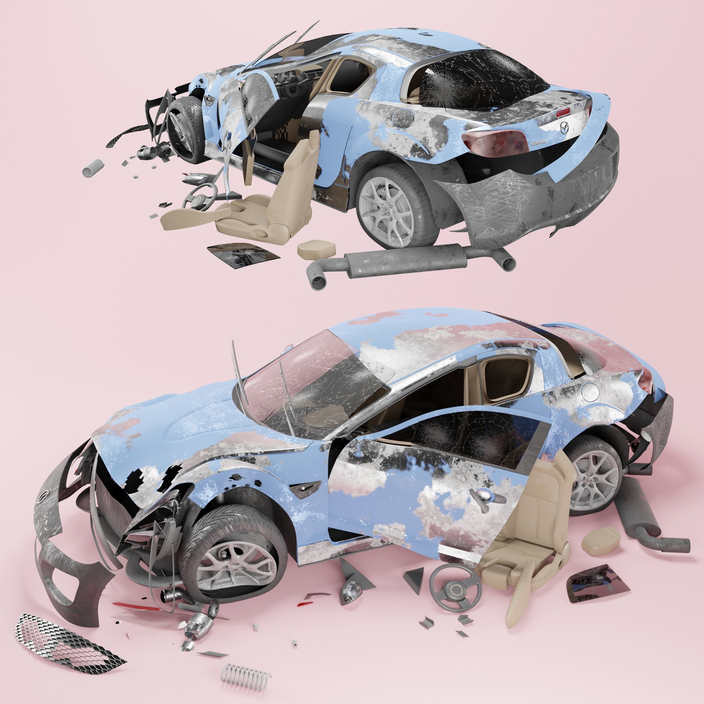
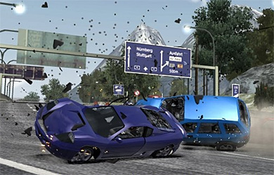
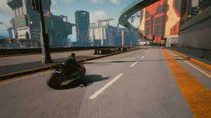

<section id="recoil">
  <h1>Recoil: Afterlife Racing</h1>
  
  
<em>A dystopian racing world where souls are reborn as cars after fatal accidents, trapped in an endless racetrack dimension called "The Loop."</em>

  <h2>Concept Overview</h2>
  
  

    In Recoil, you race through The Loop—a surreal afterlife built from broken highways and distorted memories. You are a reincarnated person trapped in a car, carrying emotional scars and fragments of your past life. The pain you feel is real. Crashing isn't failure; it's the only path to freedom.
  

  <h2>Aesthetic & Mood</h2>
  
  <ul>
    <li><strong>Primary Colors:</strong> red, orange, black</li>
    <li><strong>Secondary Colors:</strong> teal, steel blue</li>
    <li><strong>Accents:</strong> neon pinks and purples</li>
  </ul>
  
The Loop blends abandoned freeways, neon-lit voids, and glitching terrain that symbolizes fading memories.

  <h2>Vehicle Characters</h2>
  
  

    Your vehicle is based on the car you died in. But the twist is your personality shapes how that car actually looks and behaves. The same sports car model might look sleek and powerful on one racer, or broken and chaotic on another. Your vehicle is a reflection of both your death and who you are.
  

  <h2>Story Themes</h2>
  
  

    The world explores memory, control, trauma, and the idea of release. 
    Racing represents the struggle to understand one's past; 
    choosing a Final Crash represents acceptance.
  

  <h2>Life in The Loop</h2>
  
  

    This is your new reality. After dying in a car accident, you exist as a vehicle in The Loop—a twisted afterlife where you race, collide, and relive your trauma. You can feel every impact, every crash. The pain is real.
  

  

    You'll encounter other souls like you—the Numb Racer who's given up, the Obsessive who chases perfection, the Broken who's fragmented, and the Sage who's found peace. Each one represents a different way people cope with what happened to them.
  

  

    Small collisions and crashes won't free you. You can chip away at your sanity bit by bit, but you're stuck in The Loop. You need one massive, catastrophic crash—a final bang that comes from reaching peak insanity. That's your only way out.
  

  

    When you build up enough damage from all those small hits, you'll randomly get repaired. Your vehicle snaps back into shape. Then you have to do it all over again—accumulating damage, hitting other racers, collecting fragments of memory—until you finally land that one devastating final crash.
  

</section>

---

[Back to Projects](projects.md)
